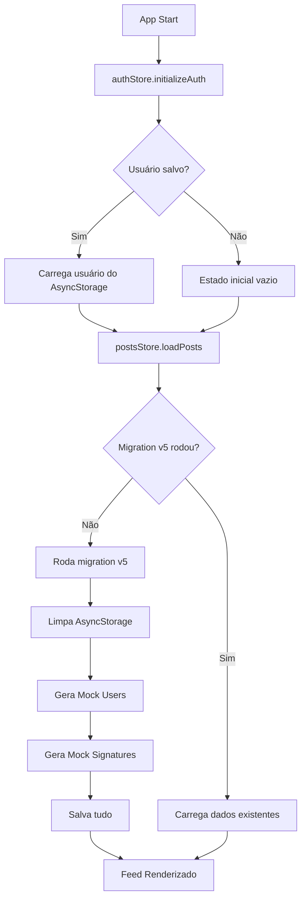

# 🗄️ Tagged - Arquitetura de Dados e AsyncStorage

## Índice
1. [Visão Geral](#visão-geral)
2. [AsyncStorage Schema](#asyncstorage-schema)
3. [Sistema de Migrations](#sistema-de-migrations)
4. [Fluxo de Dados](#fluxo-de-dados)
5. [Stores (Zustand)](#stores-zustand)
6. [Geração de Dados Mockados](#geração-de-dados-mockados)
7. [Sincronização e Consistência](#sincronização-e-consistência)

---

## Visão Geral

O Tagged utiliza **AsyncStorage** como banco de dados local para armazenar todos os dados do aplicativo, incluindo posts, assinaturas, usuários e configurações. O sistema é gerenciado por **Zustand stores** e possui um robusto sistema de migrations para versionamento de dados.

### Tecnologias

- **AsyncStorage** (`@react-native-async-storage/async-storage`) - Persistência local key-value
- **Zustand** (`zustand`) - State management reativo
- **Faker.js** (`@faker-js/faker`) - Geração de dados mockados realistas
- **TypeScript** - Type safety em toda a camada de dados

---

## AsyncStorage Schema

### Chaves Principais

| Chave | Tipo | Descrição | Tamanho Estimado |
|-------|------|-----------|------------------|
| `tagged_posts` | `Post[]` | Array de todos os posts | ~50KB (15 posts) |
| `tagged_signatures` | `Record<string, Signature[]>` | Assinaturas por post | ~5MB (posts com >1000 assinaturas) |
| `tagged_users_db` | `Record<string, User>` | Banco de usuários (email como chave) | ~100KB (~50 usuários) |
| `tagged_saved_posts` | `string[]` | IDs de posts salvos | ~1KB |
| `tagged_base_supports` | `Record<string, number>` | Supports base de cada post | ~1KB |
| `tagged_anonymous_ownership` | `string[]` | IDs de posts anônimos do usuário | ~1KB |
| `tagged_migration_v5` | `string` | Flag de migration (valor: "done") | <1KB |

### Estruturas de Dados

#### 1. Post (`tagged_posts`)

```typescript
interface Post {
  id: string;                    // UUID único
  title: string;                 // Título da denúncia
  content: string;               // Conteúdo completo
  author: UserInfo;              // Informações do autor
  isAnonymous: boolean;          // Se é denúncia anônima
  location: {
    city: string;
    state: string;
    country: string;
  };
  tags: string[];                // Tags da denúncia
  stats: {
    supports: number;            // Total de assinaturas (dinâmico)
    comments: number;
    shares: number;
    views: number;
  };
  milestones: Milestone[];       // Conquistas (100, 500, 1K, etc)
  chatUnlocked: boolean;         // Se chat colaborativo está ativo (>= 1000)
  createdAt: string;             // ISO 8601 timestamp
  urgency: "low" | "medium" | "high" | "critical";
  images?: string[];
  documents?: DocumentInfo[];
  visibility: "public" | "private";
}

interface UserInfo {
  id: string;
  name: string;
  avatar?: string;
  verified: boolean;
}

interface Milestone {
  id: string;
  target: number;                // Meta (ex: 1000)
  label: string;                 // Label (ex: "1K")
  badgeName: string;             // Nome da conquista
  badgeDescription: string;
  achieved: boolean;             // Se foi alcançado
  achievedAt?: string;           // Quando foi alcançado
  icon: string;                  // Nome do ícone (Ionicons)
  color: string;                 // Cor em hex
}
```

**Exemplo de dado salvo:**
```json
[
  {
    "id": "550e8400-e29b-41d4-a716-446655440000",
    "title": "Falta de saneamento básico na Zona Leste",
    "content": "Moradores da região enfrentam...",
    "author": {
      "id": "user-123",
      "name": "Maria Silva",
      "verified": false
    },
    "isAnonymous": false,
    "location": {
      "city": "São Paulo",
      "state": "SP",
      "country": "Brasil"
    },
    "tags": ["Saneamento", "Saúde Pública"],
    "stats": {
      "supports": 376700,
      "comments": 1234,
      "shares": 567,
      "views": 450000
    },
    "chatUnlocked": true,
    "createdAt": "2025-01-05T14:30:00.000Z"
  }
]
```

#### 2. Signatures (`tagged_signatures`)

```typescript
// Estrutura: Record<postId, Signature[]>
interface Signature {
  userId: string;
  userName: string;
  signedAt: string;              // ISO 8601 timestamp
  userAvatar?: string;
}

type SignaturesMap = Record<string, Signature[]>;
```

**Exemplo:**
```json
{
  "550e8400-e29b-41d4-a716-446655440000": [
    {
      "userId": "user-123",
      "userName": "João Santos",
      "signedAt": "2025-01-08T10:25:30.000Z"
    },
    {
      "userId": "temp_user_550e8400_0",
      "userName": "Ana Costa",
      "signedAt": "2025-01-07T15:42:18.000Z"
    }
    // ... ~300,000 assinaturas para um post com 376K supports
  ]
}
```

**Características:**
- ~80% do total de `stats.supports` são geradas como assinaturas mockadas
- Usuários temporários são criados com prefixo `temp_user_`
- Assinaturas dos últimos 30 dias (geradas com `faker.date.recent({ days: 30 })`)

#### 3. Users Database (`tagged_users_db`)

```typescript
// Estrutura: Record<email, User>
interface User {
  id: string;
  email: string;                 // Chave primária
  name: string;
  cpf: string;                   // CPF brasileiro (11 dígitos)
  phone?: string;
  avatar?: string;
  verified: boolean;
  role: "user" | "admin" | "moderator";
  bio?: string;
  location?: {
    city: string;
    state: string;
    country: string;
  };
  stats: {
    reportsCreated: number;      // Denúncias criadas
    reportsSigned: number;       // Denúncias assinadas
    impactScore: number;         // (reportsCreated * 10) + (reportsSigned * 2)
  };
  following: string[];           // IDs de usuários que segue
  followers: string[];           // IDs de seguidores
  createdAt: string;
  password: string;              // Em produção, seria hash
}

type UsersDatabase = Record<string, User>;
```

**Exemplo:**
```json
{
  "user1@tagged.com": {
    "id": "a1b2c3d4-e5f6-7890-abcd-ef1234567890",
    "email": "user1@tagged.com",
    "name": "Maria Eduarda Santos",
    "cpf": "12345678901",
    "phone": "+55 11 98765-4321",
    "verified": false,
    "role": "user",
    "bio": "Ativista pelos direitos humanos",
    "location": {
      "city": "São Paulo",
      "state": "SP",
      "country": "Brasil"
    },
    "stats": {
      "reportsCreated": 3,
      "reportsSigned": 47,
      "impactScore": 124
    },
    "following": ["user-id-1", "user-id-2", "user-id-3"],
    "followers": ["user-id-4", "user-id-5"],
    "createdAt": "2024-08-15T10:00:00.000Z",
    "password": "password123"
  },
  "temp_0@tagged.com": {
    "id": "temp_user_550e8400_0",
    "email": "temp_0@tagged.com",
    "name": "Ana Costa",
    "cpf": "98765432109",
    "role": "user",
    "verified": false,
    "stats": {
      "reportsCreated": 0,
      "reportsSigned": 1,
      "impactScore": 2
    },
    "following": [],
    "followers": [],
    "createdAt": "2025-01-08T12:00:00.000Z",
    "password": "password123"
  }
}
```

**Características:**
- Usuários reais (autores de posts) têm emails como `user1@tagged.com`
- Usuários temporários (para assinaturas) têm emails como `temp_0@tagged.com`
- CPF gerado com `faker.string.numeric(11)`
- Impact score calculado automaticamente

---

## Sistema de Migrations

### Visão Geral

O sistema de migrations garante que dados antigos sejam limpos quando há mudanças na estrutura. Cada versão força uma regeneração completa dos dados mockados.

### Versão Atual: v5

**Arquivo:** `stores/postsStore.ts` (linhas 96-114)

```typescript
const migrationKey = "tagged_migration_v5";
const migrationDone = await AsyncStorage.getItem(migrationKey);

if (!migrationDone) {
  console.log("🔄 Running migration v5: clearing old data and regenerating mock signatures...");

  await AsyncStorage.multiRemove([
    STORAGE_KEYS.POSTS,
    STORAGE_KEYS.SIGNATURES,
    STORAGE_KEYS.SAVED,
    STORAGE_KEYS.BASE_SUPPORTS,
    "tagged_users_db",
    "tagged_migration_v2",
    "tagged_migration_v3",
    "tagged_migration_v4",
  ]);

  await AsyncStorage.setItem(migrationKey, "done");
  console.log("✅ Migration v5 completed!");
}
```

### Histórico de Migrations

| Versão | Data | Mudanças |
|--------|------|----------|
| v2 | 2024-12 | Introdução de milestones dinâmicos |
| v3 | 2025-01 | Adição de base supports tracking |
| v4 | 2025-01 | Nova distribuição de supports |
| v5 | 2025-01 | Sistema de perfis e assinaturas mockadas |

### Quando Criar Nova Migration

Crie uma nova migration quando:
1. **Mudança na estrutura de dados**: Novos campos em types/interfaces
2. **Correção de dados corrompidos**: Dados antigos incompatíveis
3. **Nova feature crítica**: Requer dados diferentes dos existentes
4. **Bug fix estrutural**: Dados antigos causam problemas

**Exemplo de nova migration:**
```typescript
// FUTURO: Migration v6
const migrationKey = "tagged_migration_v6";

if (!migrationDone) {
  console.log("🔄 Running migration v6: adding new feature...");

  // Limpar dados antigos
  await AsyncStorage.multiRemove([
    // ... chaves antigas
  ]);

  // Criar nova estrutura
  // ...

  await AsyncStorage.setItem(migrationKey, "done");
  console.log("✅ Migration v6 completed!");
}
```

---

## Fluxo de Dados

### 1. Inicialização do App



### 2. Geração de Dados na Primeira Carga

```typescript
// 1. Verifica se há posts salvos
const storedPosts = await AsyncStorage.getItem(STORAGE_KEYS.POSTS);

if (!storedPosts) {
  // 2. Usa mockPosts (gerados em mockData.ts)
  posts = mockPosts;

  // 3. Gera usuários baseados nos autores dos posts
  const USERS_DB_KEY = 'tagged_users_db';
  const usersDbJson = await AsyncStorage.getItem(USERS_DB_KEY);
  let existingUsersDb = usersDbJson ? JSON.parse(usersDbJson) : {};

  if (Object.keys(existingUsersDb).length === 0) {
    const mockUsers = generateMockUsers(); // Extrai autores únicos
    await AsyncStorage.setItem(USERS_DB_KEY, JSON.stringify(mockUsers));
    existingUsersDb = mockUsers;
    console.log('✅ Mock users created and saved!');
  }

  // 4. Gera assinaturas para posts com >1000 supports
  const allUsersArray = Object.values(existingUsersDb);
  let tempUsersCreated = 0;

  posts.forEach((post: Post) => {
    if (post.stats.supports > 1000) {
      const mockSigs = generateMockSignatures(
        post.id,
        post.stats.supports,
        allUsersArray
      );

      // 5. Cria usuários temporários para assinaturas
      const signaturesForPost = mockSigs.map(sig => {
        if (sig.userId.startsWith('temp_user_')) {
          const tempEmail = `temp_${tempUsersCreated}@tagged.com`;
          existingUsersDb[tempEmail] = {
            id: sig.userId,
            email: tempEmail,
            name: sig.userName,
            cpf: faker.string.numeric(11),
            role: 'user',
            verified: false,
            createdAt: new Date().toISOString(),
            stats: {
              reportsCreated: 0,
              reportsSigned: 1,
              impactScore: 2,
            },
            following: [],
            followers: [],
            password: 'password123',
          };
          tempUsersCreated++;
        }

        return {
          userId: sig.userId,
          userName: sig.userName,
          signedAt: sig.signedAt,
        };
      });

      signaturesData[post.id] = signaturesForPost;
    }
  });

  // 6. Salva tudo
  if (tempUsersCreated > 0) {
    await AsyncStorage.setItem(USERS_DB_KEY, JSON.stringify(existingUsersDb));
    console.log(`✅ ${tempUsersCreated} temporary users created!`);
  }

  if (Object.keys(signaturesData).length > 0) {
    await AsyncStorage.setItem(STORAGE_KEYS.SIGNATURES, JSON.stringify(signaturesData));
    console.log('✅ Mock signatures created and saved!');
  }
}
```

### 3. Pull to Refresh

```typescript
refreshPosts: async () => {
  // 1. Limpa TUDO
  await AsyncStorage.multiRemove([
    STORAGE_KEYS.POSTS,
    STORAGE_KEYS.SIGNATURES,
    STORAGE_KEYS.SAVED,
    STORAGE_KEYS.BASE_SUPPORTS,
    "tagged_users_db",
    "tagged_migration_v5",
  ]);

  // 2. Delay para UX
  await new Promise((resolve) => setTimeout(resolve, 800));

  // 3. Recarrega do zero (vai gerar novos dados)
  await get().loadPosts();
}
```

---

## Stores (Zustand)

### 1. postsStore

**Arquivo:** `stores/postsStore.ts`

**Estado:**
```typescript
interface PostsState {
  posts: Post[];
  signatures: Map<string, Signature[]>;
  baseSupports: Map<string, number>;
  savedPosts: Set<string>;
  loading: boolean;
  error: string | null;
}
```

**Principais Funções:**

| Função | Descrição | AsyncStorage |
|--------|-----------|--------------|
| `loadPosts()` | Carrega posts e assinaturas | ✅ Lê de `tagged_posts`, `tagged_signatures` |
| `refreshPosts()` | Pull to refresh - recria tudo | ✅ Limpa tudo e regenera |
| `toggleSignature()` | Adiciona/remove assinatura | ✅ Salva em `tagged_signatures` |
| `toggleSave()` | Salva/remove post dos favoritos | ✅ Salva em `tagged_saved_posts` |
| `hasUserSigned()` | Verifica se usuário assinou | ❌ Lê do estado em memória |
| `getSignatures()` | Pega assinaturas de um post | ❌ Lê do estado em memória |
| `getMyPosts()` | Posts criados pelo usuário | ❌ Filtra posts em memória |
| `getSignedPosts()` | Posts assinados pelo usuário | ❌ Filtra usando `hasUserSigned()` |

### 2. authStore

**Arquivo:** `stores/authStore.ts`

**Estado:**
```typescript
interface AuthState {
  user: User | null;
  users: Record<string, User>;
  loading: boolean;
}
```

**Principais Funções:**

| Função | Descrição | AsyncStorage |
|--------|-----------|--------------|
| `initializeAuth()` | Inicializa autenticação | ✅ Lê de `tagged_current_user` |
| `login()` | Faz login do usuário | ✅ Salva em `tagged_current_user` |
| `logout()` | Faz logout | ✅ Remove `tagged_current_user` |
| `loadUsers()` | Carrega banco de usuários | ✅ Lê de `tagged_users_db` |
| `updateProfile()` | Atualiza perfil do usuário | ✅ Salva em `tagged_users_db` |
| `followUser()` | Segue um usuário | ✅ Atualiza following/followers |
| `unfollowUser()` | Deixa de seguir | ✅ Atualiza following/followers |

---

## Geração de Dados Mockados

### 1. generateMockUsers()

**Arquivo:** `services/mockData.ts` (linhas 538-593)

**Processo:**
1. Extrai todos os autores únicos dos `mockPosts` (exceto anônimos)
2. Para cada autor, cria um usuário completo com:
   - Email sequencial: `user1@tagged.com`, `user2@tagged.com`, etc
   - CPF: 11 dígitos aleatórios
   - Telefone: Formato brasileiro
   - Bio: Frase aleatória em português
   - Localização: Cidade e estado do Brasil
   - Stats: Contagem real de posts criados + número aleatório de assinadas

```typescript
export const generateMockUsers = () => {
  const users: Record<string, any> = {};

  // Extrai autores únicos
  const uniqueAuthors = mockPosts
    .filter(post => !post.isAnonymous)
    .map(post => post.author)
    .reduce((acc: any[], author) => {
      if (!acc.some(a => a.id === author.id)) {
        acc.push(author);
      }
      return acc;
    }, []);

  // Cria usuário completo para cada autor
  uniqueAuthors.forEach((author, index) => {
    const email = `user${index + 1}@tagged.com`;
    const reportsCreated = mockPosts.filter(
      p => !p.isAnonymous && p.author.id === author.id
    ).length;
    const reportsSigned = faker.number.int({ min: 5, max: 50 });

    users[email] = {
      id: author.id,
      email: email,
      name: author.name,
      cpf: faker.string.numeric(11),
      phone: faker.phone.number(),
      verified: author.verified || false,
      role: 'user',
      bio: faker.lorem.sentence(),
      location: {
        city: faker.location.city(),
        state: faker.location.state({ abbreviated: true }),
        country: 'Brasil',
      },
      stats: {
        reportsCreated: reportsCreated,
        reportsSigned: reportsSigned,
        impactScore: (reportsCreated * 10) + (reportsSigned * 2),
      },
      following: [],
      followers: [],
      password: 'password123',
    };
  });

  return users;
};
```

### 2. generateMockSignatures()

**Arquivo:** `services/mockData.ts` (linhas 596-627)

**Processo:**
1. Recebe `postId`, `totalSupports`, e array de usuários existentes
2. Calcula quantidade de assinaturas: `Math.floor(totalSupports * 0.8)` (80%)
3. Para cada assinatura:
   - 50% de chance de usar usuário existente
   - 50% de chance de criar usuário temporário
4. Retorna array de assinaturas com userId, userName, signedAt

```typescript
export const generateMockSignatures = (
  postId: string,
  totalSupports: number,
  allUsers: any[]
) => {
  const signatures: any[] = [];
  const mockSignaturesCount = Math.floor(totalSupports * 0.8);

  for (let i = 0; i < mockSignaturesCount; i++) {
    let user;

    if (i < allUsers.length && faker.datatype.boolean()) {
      // Reutiliza usuário existente
      user = allUsers[i % allUsers.length];
    } else {
      // Cria usuário temporário
      user = {
        id: `temp_user_${postId}_${i}`,
        name: faker.person.fullName(),
        cpf: faker.string.numeric(11),
        email: `supporter${i}@tagged.com`,
      };
    }

    signatures.push({
      userId: user.id,
      userName: user.name,
      signedAt: faker.date.recent({ days: 30 }),
    });
  }

  return signatures;
};
```

---

## Sincronização e Consistência

### Garantias de Consistência

#### 1. Posts e Signatures
- **Sempre em sincronia**: Quando um usuário assina/remove assinatura, ambos são atualizados
- **Stats dinâmicos**: `stats.supports` é recalculado baseado em `baseSupports + signatures.length`

```typescript
toggleSignature: async (postId, userId, userName) => {
  const { signatures, posts, baseSupports } = get();
  const postSignatures = signatures.get(postId) || [];

  // Adiciona ou remove assinatura
  let newSignatures: Signature[];
  if (existingIndex >= 0) {
    newSignatures = postSignatures.filter((sig) => sig.userId !== userId);
  } else {
    newSignatures = [...postSignatures, { userId, userName, signedAt: new Date().toISOString() }];
  }

  // Atualiza Map de signatures
  signatures.set(postId, newSignatures);

  // Recalcula supports do post
  const updatedPosts = posts.map((p) =>
    p.id === postId
      ? {
          ...p,
          stats: {
            ...p.stats,
            supports: (baseSupports.get(postId) || 0) + newSignatures.length,
          },
        }
      : p
  );

  // Salva no AsyncStorage
  await AsyncStorage.setItem(STORAGE_KEYS.SIGNATURES, JSON.stringify(Object.fromEntries(signatures)));
  await AsyncStorage.setItem(STORAGE_KEYS.POSTS, JSON.stringify(updatedPosts));

  set({ posts: updatedPosts, signatures });
}
```

#### 2. Following/Followers
- **Bidirecional**: Quando A segue B, `A.following` e `B.followers` são atualizados
- **Atomic**: Ambas as mudanças ocorrem na mesma transação

```typescript
followUser: async (userId: string) => {
  const { user } = get();

  // Atualiza usuário atual
  const updatedUser = {
    ...user,
    following: [...(user.following || []), userId],
  };

  // Carrega banco de usuários
  const usersDb = JSON.parse(await AsyncStorage.getItem('tagged_users_db'));

  // Atualiza following do usuário atual
  usersDb[user.email].following = updatedUser.following;

  // Atualiza followers do outro usuário
  const targetUserEmail = Object.values(usersDb).find(u => u.id === userId)?.email;
  if (targetUserEmail) {
    usersDb[targetUserEmail].followers = [
      ...(usersDb[targetUserEmail].followers || []),
      user.id,
    ];
  }

  // Salva tudo de uma vez
  await AsyncStorage.setItem('tagged_users_db', JSON.stringify(usersDb));

  set({ user: updatedUser });
}
```

### Tratamento de Erros

```typescript
try {
  await AsyncStorage.setItem(key, JSON.stringify(data));
} catch (error) {
  console.error('AsyncStorage error:', error);
  set({ error: 'Erro ao salvar dados' });
}
```

---

## Performance e Otimizações

### 1. Lazy Loading
- Posts carregados apenas uma vez na inicialização
- Assinaturas carregadas apenas quando necessário (petição)

### 2. Memoização
- Zustand usa shallow equality para prevenir re-renders desnecessários
- Selectors otimizados:

```typescript
const posts = usePostsStore(state => state.posts);
const hasUserSigned = usePostsStore(state => state.hasUserSigned);
```

### 3. Batch Updates
- Multiple updates agrupados antes de salvar no AsyncStorage

### 4. Tamanho dos Dados

| Tipo | Quantidade | Tamanho |
|------|------------|---------|
| Posts | 15 | ~50KB |
| Usuários reais | ~15 | ~30KB |
| Usuários temporários | ~300,000 (para posts grandes) | ~4MB |
| Assinaturas | ~300,000 (posts com >1000 supports) | ~5MB |
| **Total** | - | **~9MB** |

---

## Debugging

### Verificar Dados no AsyncStorage

```typescript
import AsyncStorage from '@react-native-async-storage/async-storage';

// Ver todas as chaves
const keys = await AsyncStorage.getAllKeys();
console.log('AsyncStorage keys:', keys);

// Ver posts
const posts = await AsyncStorage.getItem('tagged_posts');
console.log('Posts:', JSON.parse(posts));

// Ver usuários
const users = await AsyncStorage.getItem('tagged_users_db');
console.log('Users:', JSON.parse(users));

// Ver assinaturas
const signatures = await AsyncStorage.getItem('tagged_signatures');
console.log('Signatures:', JSON.parse(signatures));
```

### Limpar Tudo (Reset)

```typescript
await AsyncStorage.clear();
console.log('AsyncStorage cleared!');
```

### Forçar Nova Migration

```typescript
await AsyncStorage.removeItem('tagged_migration_v5');
// Reiniciar app - migration vai rodar novamente
```

---

**Última atualização:** 08/01/2026
**Versão da Documentação:** 1.0
**Migration Atual:** v5
